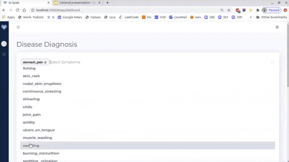

# AI -SPAB 
 This application provides prediction of a disease when symptoms are provided from patient, the dashboard view is made for doctor and patients to view analytics 
  

## Technologies - Used
<code></code> 
<code></code>
<code></code>

<code></code>

<code></code>

